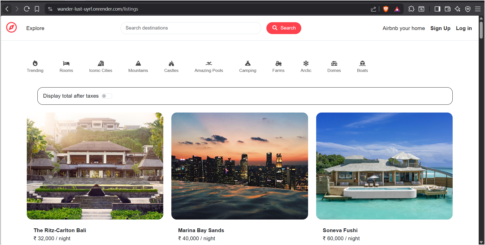
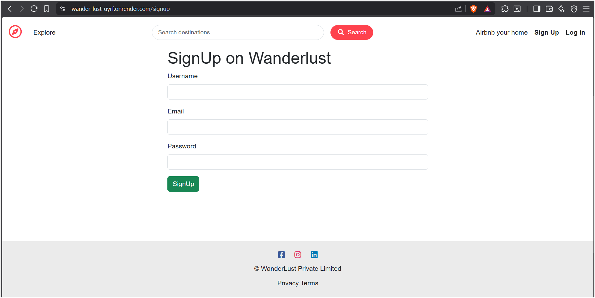
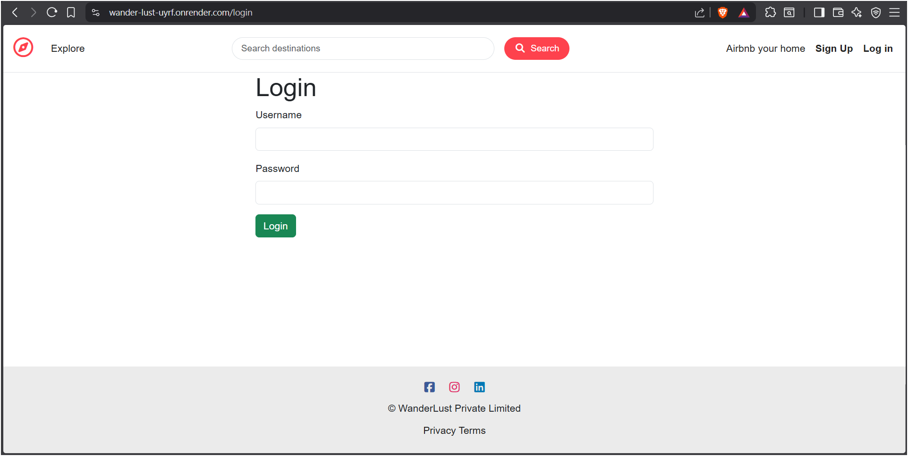
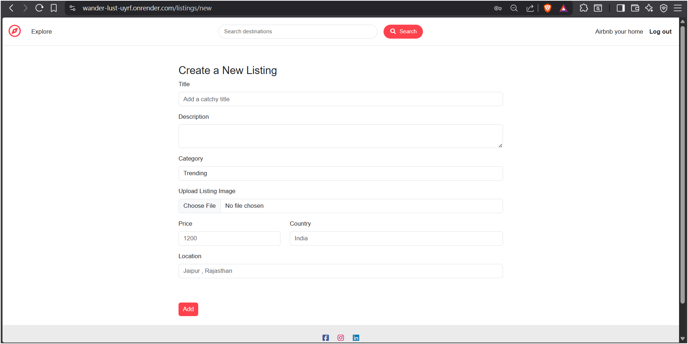
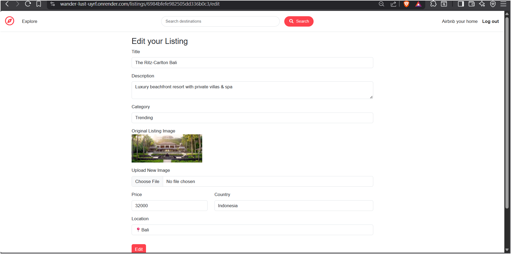

# 🌍 Wanderlust – Travel Listing Platform

A full-stack travel listing web application that allows users to explore, search, and manage travel destinations with interactive map-based discovery.

---

## 🚀 Live Demo
🔗 https://wander-lust-uyrf.onrender.com/listings

---

## 🛠 Tech Stack
- Frontend: HTML, CSS, Bootstrap, EJS
- Backend: Node.js, Express.js
- Database: MongoDB
- Maps: Leaflet.js

---

## ✨ Features

- 🗺 Map-based property discovery using Leaflet.js  
- 🔐 User authentication with cookie-based session management  
- 🔍 Advanced search and filtering functionality  
- 📱 Fully responsive design (mobile, tablet, desktop)  
- 📝 CRUD operations for listings and reviews  
- ⚡ Optimized performance and faster load times  

---

## 📸 Screenshots

### 🏠 Home / Listings Page


### 🔐 Signup Page


### 🔐 Login Page


### 🗺️ Map Integration


### 🔍 Search Functionality


### 📝 Create Listing


### ✏️ Edit Listing


---

## 🧠 Key Highlights

- Built RESTful APIs for scalable data handling  
- Improved user search efficiency with filtering (~40%)  
- Reduced load time through backend optimization (~30%)  
- Designed responsive UI for seamless experience across devices  

---

## ⚙️ Installation

```bash
git clone https://github.com/VeereshMK-07/WanderLust
cd WanderLust
npm install
npm start
