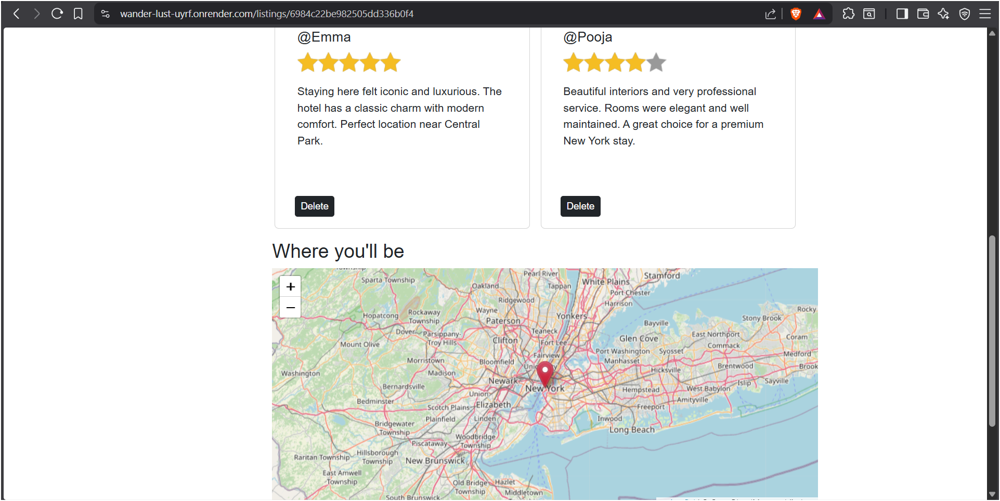
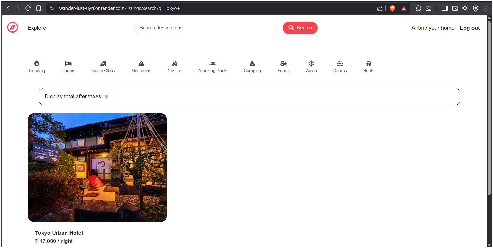

# 🌍 Wanderlust – Travel Listing Platform (Full-Stack)

A full-stack travel listing web application that enables users to explore, search, and manage travel destinations with interactive map-based discovery.


---

## 🚀 Live Demo
🔗 https://wander-lust-uyrf.onrender.com/listings  

💡 Explore listings, search destinations, and view locations directly on the interactive map.

---

## 🧠 Project Overview

A full-stack travel platform designed to simulate real-world listing applications.  
Users can browse destinations, create listings, leave reviews, and explore locations via interactive maps.

The project demonstrates scalable backend architecture, efficient search functionality, and responsive UI design.

---

## ✨ Features

- 🗺 Map-based property discovery using Leaflet.js  
- 🔐 Secure user authentication with session management  
- 🔍 Advanced search and filtering functionality  
- 📱 Fully responsive design (mobile, tablet, desktop)  
- 📝 CRUD operations for listings and reviews  
- ⚡ Optimized backend performance for faster load times  

---

## 🛠 Tech Stack

**Frontend**
- HTML, CSS, Bootstrap, EJS  

**Backend**
- Node.js, Express.js  

**Database**
- MongoDB  

**Other**
- Leaflet.js (Map integration)

---

## 📸 Screenshots

### 🏠 Home / Listings Page
<p align="center">
  
</p>

---

### 🔐 Signup Page
<p align="center">
  
</p>

---

### 🔐 Login Page
<p align="center">
  
</p>

---

### 🗺️ Map Integration
<p align="center">
  
</p>

---

### 🔍 Search Functionality
<p align="center">
  
</p>

---

### 📝 Create Listing
<p align="center">
  
</p>

---

### ✏️ Edit Listing
<p align="center">
  
</p>

---

## 🧠 Key Highlights

- 🚀 Built RESTful APIs for scalable data handling  
- 🔍 Improved search efficiency with filtering (~40%)  
- ⚡ Reduced load time through backend optimization (~30%)  
- 📱 Designed responsive UI for seamless cross-device experience  

---


## ⚙️ Installation

```bash
git clone https://github.com/VeereshMK-07/WanderLust
cd WanderLust
npm install
npm start

-------

## 🎯 Impact

- 🌍 Enabled users to explore and discover travel destinations through interactive map-based listings  
- 🔍 Improved search efficiency by ~40% using optimized filtering and query handling  
- ⚡ Reduced page load time by ~30% through backend optimizations and efficient data rendering  
- 📱 Delivered a fully responsive user experience across mobile, tablet, and desktop devices  .

----

👨‍💻 Author

Veeresh M Kakamari

🔗 GitHub: https://github.com/VeereshMK-07
💼 LinkedIn: https://www.linkedin.com/in/veeresh-kakamari/
